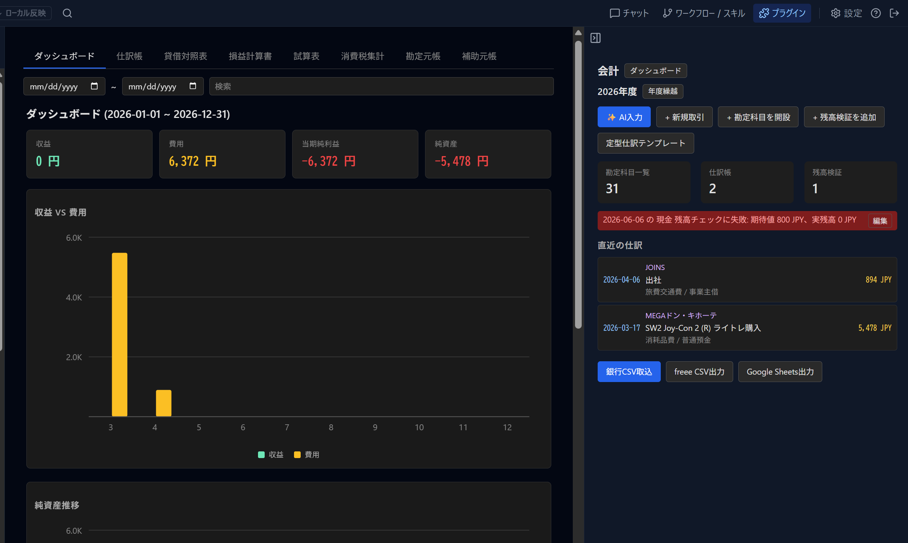

# Accounting - Double-Entry Bookkeeping



A shared [GemiHub](https://github.com/takeshy/gemihub) and GemiHub Desktop plugin for Beancount-compatible double-entry bookkeeping. Manage accounts, record transactions, and generate financial reports — all in plain text.

[Japanese / 日本語](README_ja.md)

## Features

- **Beancount format** — read and write standard `.beancount` / `.bean` / `.ledger` files
- **Double-entry bookkeeping** — every transaction must balance (debits = credits)
- **Chart of accounts** — hierarchical accounts with five types: Assets, Liabilities, Income, Expenses, Equity
- **Transaction entry** — sidebar form with payee, narration, multiple postings, tags, and links
- **Auto-balancing** — leave one posting amount blank and it fills automatically
- **Financial reports** — balance sheet, income statement, trial balance
- **Validation** — unbalanced transactions, missing accounts, closed account usage, balance assertions
- **Beancount directives** — open, close, balance, pad, commodity, option
- **Export** — save to Drive as `.beancount` file
- **Bilingual UI** — English and Japanese

## Installation

1. Go to **Settings > Plugins** in GemiHub, or open the Plugin manager in GemiHub Desktop 0.8.1+
2. Enter `takeshy/hub-accounting`
3. Click **Install**

The same GitHub Release is used by both hosts. GemiHub loads `main.js` directly; GemiHub Desktop applies the repository-owned `patches/gemihub-desktop.patch` declared in `manifest.json` (GitHub publishes its basename as the release asset). Desktop stores ledgers in the active Workspace and exposes the report view as a second sidebar tab. Google Sheets export remains available only when the host provides the optional Sheets API.

## Usage

1. Open the Accounting panel in the GemiHub sidebar
2. Click **New Ledger** to create a ledger with default accounts, or open an existing `.beancount` file
3. Add accounts via **Open Account** — choose a type (Assets, Liabilities, etc.) and name
4. Record transactions via **New Transaction** — enter date, payee, narration, and at least two postings
5. View reports in the main view — journal, balance sheet, income statement, trial balance

## Architecture

```
src/
├── main.ts                  # Plugin entry point
├── types.ts                 # Shared types (Account, Transaction, LedgerData, etc.)
├── i18n.ts                  # Internationalization (en/ja)
├── store.ts                 # State management
├── core/
│   ├── parser.ts            # Beancount format parser
│   ├── formatter.ts         # Beancount format formatter (LedgerData → text)
│   ├── ledger.ts            # Ledger engine (balances, validation, CRUD)
│   └── reports.ts           # Report generation (balance sheet, income statement, trial balance)
└── ui/
    ├── LedgerPanel.tsx      # Sidebar panel (transaction entry, account management)
    ├── MainView.tsx         # Main view (reports display)
    └── SettingsPanel.tsx    # Settings dialog
```

## Settings

| Setting | Default | Description |
|---|---|---|
| Default Currency | JPY | Currency used for new postings |
| Date Format | yyyy-MM-dd | Display format for dates |
| Decimal Places | 0 | Number of decimal places for amounts |

## Development

```bash
npm install
npm run dev      # Watch mode
npm run build    # Type-check + production bundle
npm test         # Run vitest
```

### Deploy

```bash
cp main.js styles.css manifest.json ~/pkg/gemihub/data/plugins/accounting/
```

## License

MIT
